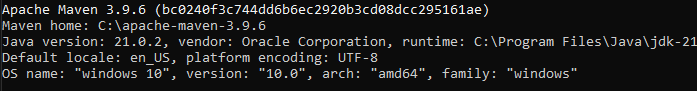

## Uvod u Maven

Maven je moćan alat za upravljanje projektima, koji se zasniva na POM (project object model). Koristi se za kreiranje projekata, zavisnosti i dokumentaciju.

Pojednostavljuje proces izgradnje kao ANT, ali je dosta napredniji od njega. Ant je više kao `build tool`, a Maven se ponaša kao alat za upravljanje projektima.

### Ključne karakteristike

**Upravljanje zavisnostima**: Maven automatski preuzima potrebne biblioteke i plugine za naš projekat iz centralnog repozitorijuma. To znači da ne moramo ručno preuzimati i dodavati jar datoteke u naš projekat.
**Konvencija nad konfiguracijom**: Maven projekyi slijede standardnu strukturu direktorijuma i formatiranje konfiguracijskih datoteka, što olakšava razumijevanje i upravljanje projektima, čak iako nismo njihov originalni autor.
**Životni ciklus izgradnje**: Maven koristi unaprijed definisane životne cikluse izgradnje, (npr. **`clean`**, **`compile`**, **`test`**, **`package`**, **`install`**, **`deploy`**), koji olakšavaju definisanje i razumijevanje procesa izgradnje.
**Plugini i ciljevi**: MAven se oslanje na plugine za izvršavanje zadataka. Svaki plugin može imati više ciljeva koji se mogu izvršiti.

## Instalacija i konfiguracija

**Korak 1 - Download**
- Preuzimanje odgovarajućeg fajla sa ovog [linka](https://maven.apache.org/download.cgi).

**Korak 2 - Dodavanje System Environment Variables**
- U dijelu System variables, klikne se na dugme *New*, kako bi dodali novu `system environment variable`. Ukucamo **MAVEN_HOME** kao ime varijable i dodamo path do Maven direktorijuma.

**Korak 3 - Dodavanje %MAVEN_HOME%\bin unutar Path-a**
- Klikne se na Path, pa na New dugme i doda se unutar polja *%MAVEN_HOME%\bin*. Sačuva se sve.

**Korak 4 - Verifikacija Maven instalacije**
- U command prompt-u se ukuca komanda *mvn -version*, i ako se dobije nešto slično ovome na slici ispod, onda je Maven uspješno instaliran.

