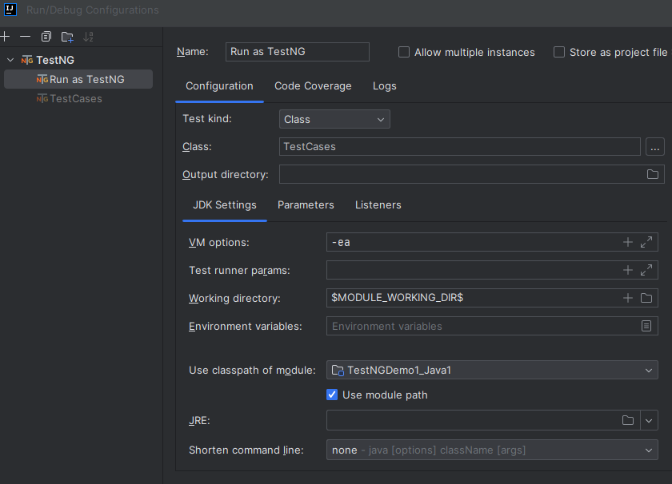
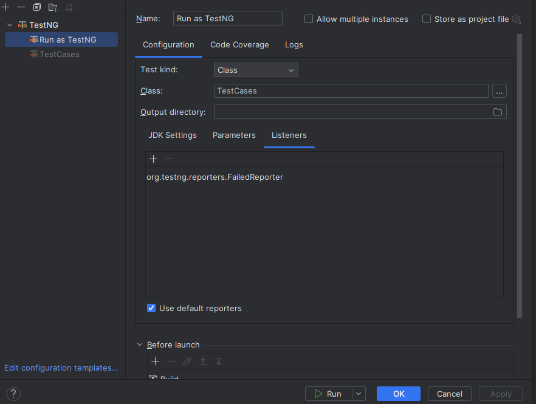
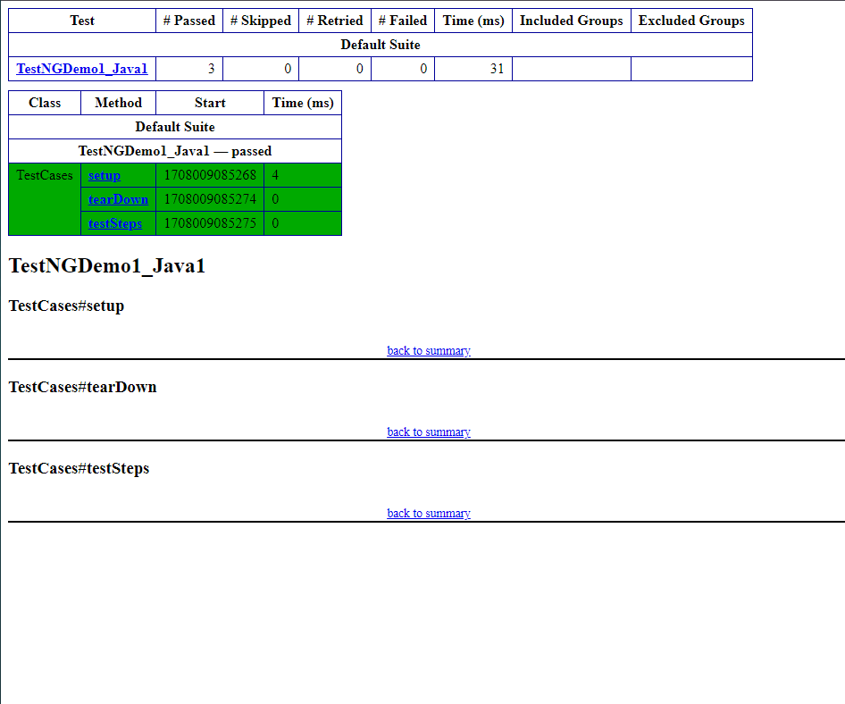
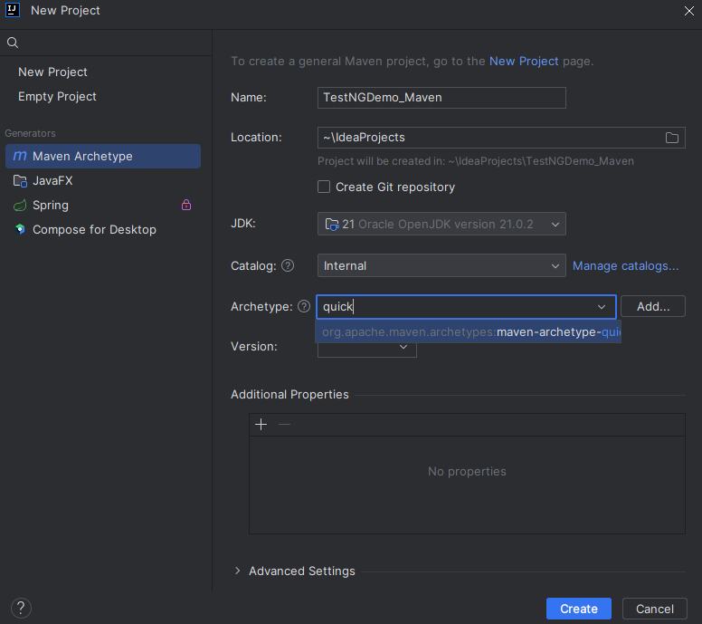
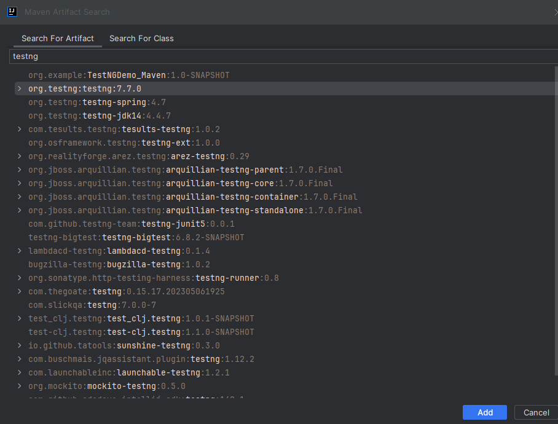
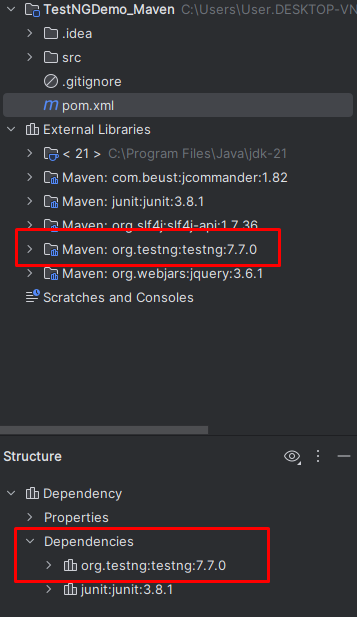
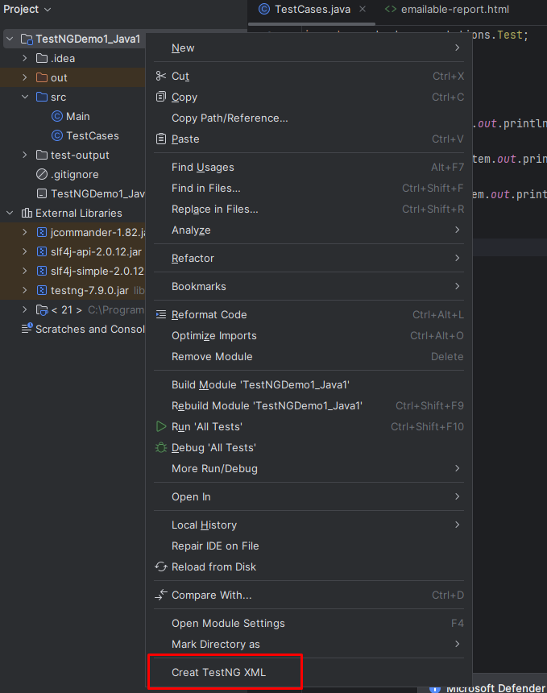
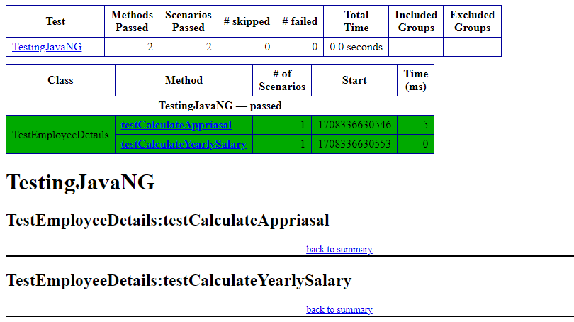

# TestNG (Testing framework for next generations )

## Uvod u TestNG

TestNG je open-source testing framework, koji je namijenjen **Java** programskom jeziku, a razvio ga je Cédric Beust. Omogućava pisanje specifičnih testova, koji provjeravaju ispravnost, efikasnost i očekivano ponašanje djelova aplikacije. Inspirisan je JUnit-om i prevazilazi njegove nedostatke, jer je dizajniran da olakša testiranje do kraja.

#### Neke prednosti TestNG-a u odnosu na JUnit

- Anotacije su lakše za razumijevanje
- Test slučajevi (cases) mogu lakše da se grupišu
- Moguće je paralelno testiranje
- Proizvodi HTML izvještaje za implementaciju
- Generiše logove
- Podržava tri dodatna nivoa, kao što su **@Before/After suite**, **@Before/AfterTest** i **Before/AfterGroup**
- Koristi više Java i OO funkcija

Koristeći TestNG, možemo da generišemo odgovarajući izvještaj i da lako saznamo koliko je test slučajeva prošlo, neuspješno ili preskočeno. Neuspjele test slučajeve možemo da izvršimo zasebno.

**Primjer:** Imamo 5 test slučajeva i jedna metoda je napisana za svaki od njih. (Pretpostavka da je program napisan koristeći glavnu metodu bez upotrebe TestNG.) Kada prvo pokrenemo program, uspješno se izvršavaju tri metode, a četvrta je neuspješna. Zatim, ispravimo greške prisutne u četvrtoj metodi i želimo da pokrenemo samo nju, jer se prve tri svakako izvršavaju uspješno. Sve ovo ne bi bilo moguće bez TestNG-a.

## Ključne karakteristike

- **Anotacije** (za laku identifikaciju metoda testa) - linije koda koje mogu da kontrolišu kako će se izvršiti metoda ispod njih. Uvijek im prethodi simbol **@**. Primjer:

```java
@Test(priority = 0)
public void goToHomepage() {
    driver.get(baseUrl);
    Assert.assertEquals(driver.getTitle(), "Welcome: Simon S");
}

@Test(priority = 1)
public void logout() {
    driver.findElement(By.linkText("SIGN-OFF")).click();
    Assert.assertEquals("Sign-on: Simon S", driver.getTitle());
}
```

Ovaj primjer jednostavno pokazuje, da metoda **goToHomepage()** treba da se izvrši prije **logout()** metode, jer ima niži prioritet.

- **Fleksibilne konfiguracije testova** - omogućava kreiranje fleksibilnih i dinamičkih konfiguracija testova, korišćenjem XML datoteka. To znači da lako možemo definisati kako, kada i koji testovi treba da se pokrenu, što je posebno korisno za složene test scenarije.
- **Podrška za paralelno izvršavanje testova** - značajno smanjuje vrijeme potrebno za izvršavanje velikog broja testova.
- **Snažna izvještavanja** - pruža detaljne izvještaje o izvršenju testova.
- **Zavisnosti** - podržava definisanje zavisnosti između test metoda.

## TestNG okruženje

- Sistemski zahtijevi : JDK 1.7 ili više

**Korak 1 - Instalacija Java programa**
- Instalirati Java program, ako već nije instaliran. Link za instalaciju Java Software Development Kit (SDK): https://www.oracle.com/technetwork/java/javase/downloads/index.h

**Korak 2 - Podešavanje Java okruženja**
- Podesiti environment varijablu JAVA_HOME da ukazuje na lokaciju osnovnog direktorijuma, gdje je Java instalirana. Npr. za *Windows* podesiti varijablu JAVA_HOME na *C:\Program Files\Java\jdk15.0.2.* Zatim, dodati lokaciju Java kompajlera u sistemsku putanju. Dodati string *C:\Program Files\Java\jdk1.7.0_25\bin* na kraju System Variable, Path-a. Provjeriti instalaciju koristeći komandu *java -version* unutar komandne linije.

**Koark 3 - Preuzeti TestNG Archive**
- Preuzeti najnoviju verziju TestNG jar datoteke sa http://www.testng.org ili [odavde](https://mvnrepository.com/artifact/org.testng/testng).

**Korak 4 - Podešavanje TestNG okruženja unutar IntelliJ IDEA (bez Maven-a)**
- Prvo kreiramo JAVA projekat i zatim Java klasu, npr. pod nazivom **TestCases** unutar foldera *test/java*. Zatim, u gornjem dijelu menu-a odemo na `File` i kliknemo na `Project Structures`. Odaberemo opciju `Modules` sa lijeve strane i kao `Dependencies` ubacimo prethodno skinuti testng.jar fajl. Po potrebi, (prilikom pokretanja testova će doći obavještenje) sa Maven repozitorijuma skinuti *jcommander.jsr*, *slf4j-api.jar* i *slf4j-simple.jar*, pa ih takođe dodati u dependencies. 

**Korak 5 - Testiranje TestNG setup-a i verifikacija rezultata**
- U prethodno kreiranoj Java klasi, unesemo kod ispod. Ovaj dio `@Test`, što je unutar Java koda, dodajemo nakon što ispišemo *println*, čim mi dodamo `@`, pojaviće nam se `Test` na koji kliknemo. Zatim, pokrenemo test za klasu TestCases (desni klik na @Test, pa na `Run TestCases`). 

```java
import org.testng.annotations.Test;

public class TestCases {

@Test
    void setup () {
        System.out.println("I am inside setup");
    }
@Test
    void testSteps() {
        System.out.println("I am inside test steps");
    }
@Test
    void tearDown() {
        System.out.println("I am inside tearDown");
    }

}
```
Trebalo bi da dobijemo sledeći output:

```html
I am inside setup
I am inside tearDown
I am inside test steps

===============================================
Default Suite
Total tests run: 3, Passes: 3, Failures: 0, Skips: 0
===============================================
```
**NAPOMENA:** Ako se desi da *println* stvara neke greške, otići na File opciju, pa na Invalidate Caches i restartovati sistem. Sve greške će nestati.

**Korak 6 - Edit Configuration**
- U menu-ju idemo na opciju `Run`, gdje biramo tab `Edit Configuration` i  na znak `+` dodamo TestNG. Ispod je slika kako bi trebalo popuniti konfiguraciju:



Klikne se na **Apply**, pa **OK**. Sada, kada pritisnemo desni klik unutar editora gdje nam je kod, imamo opciju **Run as TestNG**, a to nam je omogućeno zahvaljujući TestNG plugin-u koji je dodat u naš IntelliJ. 

**Korak 7 - Reports**
- U menu-ju idemo na opciju `Run`, pa opet biramo tab `Edit Configuration`, spuštamo se do dijela gdje su `Listeners` i na znak `+` dodamo report kao sa slike ispod:



Kliknemo na **Apply** i **OK**, pa opet pokrenemo **Run as TestNG** u editoru. Sa lijeve strane, u fajlovima će se prikazati html fajl (*emailable-report.html*), gdje je smješten report (unutar test-output foldera), a on otprilike zgleda ovako kada se otvori:



TestNG je moguće dodati i kao zavisnost u naš projekat, koristeći `Maven`, bez potrebe za ručnim dodavanjem TestNG jar datoteka. Postupak će biti objašnjen u narednoj sekciji.

## Dodavanje TestNG-a koristeći Maven

- Prvi korak jeste dodati `Maven`, a kratko uputstvo za to se nalazi u fajlu *Maven.md*. Sledeći korak je pravljenje novog projekta u IntelliJ. Na slici ispod su detalji koje treba popuniti:



- Sada, u menu-ju gore odemo na stavku `Code`, pa kliknemo na `Generate`, gdje će se otvoriti prozor u kojem biramo `Dependency`. Ptretražimo *testng* i kliknemo na `Add`. To bi ovako trebalo da izgleda:



U dijelu gdje je struktura projekta, jasno se vidi folder Dependencies i Maven unutar External Libraries.



Kada se odradi sve to, na isti način kao i prije, kreira se java klasa i pokrene se test. Isti je proces i za dobijanje krajnjeg izvještaja.

## Kreiranje testng.xml

- U menu-ju pronaći `Settings` i u dijelu `Plugins` pretražiti **Create TestNG XML** plugin, zatim ga instalirati. Zatim se vratiti na projekat, desni klik na folder sa projektom i pokrenuti komandu `Creat TestNG XML `. Fajl će se pojaviti unutar projekta. (*testng.xml*)



Kada se to završi, unutar testng.xml fajla ubaciti ovaj kod, koji kada pokrenemo (kliknemo na testng.xml fajl i `Run`), daje isti rezultat kao i kada smo u prethodnim primjerima radili `Run as TestNG`.

```java
<?xml version="1.0" encoding="UTF-8"?>
<!DOCTYPE suite SYSTEM "http://testng.org/testng-1.0.dtd">
<suite name="All Test Suite">
    <test verbose="2" preserve-order="true" name="Test">

        <classes>
            <class name="TestCases"></class>
        </classes>
    </test>
</suite>
```
Dakle, zaključak može biti sljedeći:

- Kreiranje *testng.xml* fajla omogućava veću fleksibilnost u konfiguraciji testova. Možemo lako definisati različite suite-ove, grupisati testove, postaviti prioritete izvršavanja, konfigurisati listenere i sl. Ovo je korisno ako nam je potrebna napredna kontrola nad izvršavanjem testova.

- Integracija TestNG-a putem Maven-a, omogućava automatsko upravljanje zavisnostima i izgradnjom projekta. Ovo je korisno u kontinuiranoj integraciji (CI) i kontinuiranoj isporuci (CD) okruženjima, gdje je potrebno automatizovati procese izgradnje, testiranja i isporuke.

- Dodavanje TestNG-a putem Maven-a može biti jednostavniji početni korak, posebno za početnike ili manje iskusne developere. Maven automatski rješava zavisnosti, što olakšava početak rada sa TestNG-om.

- Korišćenje testng.xml fajla omogućava veću portabilnost projekta, jer možemo lako prenijeti konfiguraciju testova između različitih razvojnih okruženja ili čak između različitih alata za izgradnju i testiranje.

## Pisanje testova

- Prvo napisati biznis logiku naših testova i ubaciti TestNG anotacije u kod
- Dodati informacije o testovima (npr. ime klase, grupe koje želimo da pokrenemo itd.) u testng.xml ili build.xml fajlu
- Kompletan primjer TestNG testiranja koristeći POJO (plain old Java object) klasu, Business logic klasu i test xml, koji će pokrenuti TestNG:

Kreirati **EmployeeDetails.java** u **/work/testng/src**, koja je POJO klasa.

```java
public class EmployeeDetails {

   private String name;
   private double monthlySalary;
   private int age;

   // @return the name

   public String getName() {
      return name;
   }

   // @param name the name to set

   public void setName(String name) {
      this.name = name;
   }

   // @return the monthlySalary

   public double getMonthlySalary() {
      return monthlySalary;
   }

   // @param monthlySalary the monthlySalary to set

   public void setMonthlySalary(double monthlySalary) {
      this.monthlySalary = monthlySalary;
   }

   // @return the age

   public int getAge() {
      return age;
   }

   // @param age the age to set

   public void setAge(int age) {
      this.age = age;
   }
}
```
**EmployeeDetails klasa** se koristi za:

- dobijanje/podešavanje vrijednosti imena zaposlenog
- dobijanje/podešavanje vrijednosti mjesečne zarade zaposlenog
- dobijanje/podešavanje vrijednosti godina zaposlenog

Kreirati **EmpBusinessLogic.java** u **/work/testng/src**, koja sadrži biznis logiku.

```java
public class EmpBusinessLogic {

   // Calculate the yearly salary of employee
   public double calculateYearlySalary(EmployeeDetails employeeDetails) {
      double yearlySalary = 0;
      yearlySalary = employeeDetails.getMonthlySalary() * 12;
      return yearlySalary;
   }

   // Calculate the appraisal amount of employee
   public double calculateAppraisal(EmployeeDetails employeeDetails) {

      double appraisal = 0;

      if(employeeDetails.getMonthlySalary() < 10000) {
         appraisal = 500;

      } else {
         appraisal = 1000;
      }

      return appraisal;
   }
}
```
**EmpBusinessLogic** klasa se koristi za izračunavanje:
 - godišnje zarade zaposlenog
 - iznosa povećanja plate zaposlenog

Sada, kreiramo TestNG klasu **TestEmployeeDetails.java** u  /work/testng/src. TestNG klasa je Java klasa koja sadrži barem jednu TestNG anotaciju. Ova klasa sadrži test slučajeve koji treba da budu testirani. TestNG test može biti konfigurisan pomoću @BeforeXXX i @AfterXXX anotacija, što omogućava izvršenje određene Java logike prije i posle određene tačke.

```java
import org.testng.Assert;
import org.testng.annotations.Test;

public class TestEmployeeDetails {
   EmpBusinessLogic empBusinessLogic = new EmpBusinessLogic();
   EmployeeDetails employee = new EmployeeDetails();

   @Test
   public void testCalculateAppriasal() {

      employee.setName("Rajeev");
      employee.setAge(25);
      employee.setMonthlySalary(8000);

      double appraisal = empBusinessLogic.calculateAppraisal(employee);
      Assert.assertEquals(500, appraisal, 0.0, "500");
   }

   // Test to check yearly salary
   @Test
   public void testCalculateYearlySalary() {

      employee.setName("Rajeev");
      employee.setAge(25);
      employee.setMonthlySalary(8000);

      double salary = empBusinessLogic.calculateYearlySalary(employee);
      Assert.assertEquals(96000, salary, 0.0, "8000");
   }
}
```
Klasa **TestEmployeeDetails** se koristi za testiranje metoda klase **EmpBusinessLogic**. Ona radi sledeće:

- Testira godišnju platu zaposlenog
- Testira iznos povećanja plate zaposlenog

Prije nego što možemo pokrenuti testove, moramo konfigurisati TestNG koristeći poseban XML fajl, koji se obično naziva testng.xml. Sintaksa za ovaj fajl je veoma jednostavna, a sadržaj je prikazan ispod. Dakle, kada napravimo gore pomenute java klase, neophodno je da dodamo TestNG na neki od dva načina koji su opisani u tekstu.

```html
<?xml version = "1.0" encoding = "UTF-8"?>
<!DOCTYPE suite SYSTEM "http://testng.org/testng-1.0.dtd" >

<suite name = "Suite1">
   <test name = "test1">
      <classes>
         <class name = "TestEmployeeDetails"/>
      </classes>
   </test>
</suite>
```
Detalji gore navedenog fajla su:

- Jedinica testiranja je predstavljena jednim XML fajlom. Može sadržati jedan ili više testova i definiše se pomoću taga `<suite>`.
- Tag `<test>` predstavlja jedan test i može da sadrži jednu ili više TestNG klasa.
- Tag `<class>` predstavlja TestNG klasu. To je Java klasa koja sadrži barem jednu TestNG anotaciju. Može da sadrži jednu ili više metoda za testiranje.

 Kada smo odradili sve neophodne korake za dodavanje TestNG-a, kliknemo na opisanu komandu `Run as TestNG`. Ako je sve urađeno ispravno, naredni korak bi mogao biti dodavanje `.xml` fajla i dobijanje reporta. Izvještaj bi izgledao otprilike ovako: 



## Osnovne anotacije

Anotacije su formalno dodate u Java jezik, a TestNG je izabrao da koristi anotacije za označavanje test klasa. Lista anotacija koje TestNG podržava:

1. **`@BeforeSuite`**
- Anotirana metoda će se izvršiti samo jednom prije nego što se izvrše svi testovi u ovom setu.
2. **`@AfterSuite`**
- Anotirana metoda će se izvršiti samo jednom nakon što se izvrše svi testovi u ovom setu.
3. **`@BeforeClass`**
- Anotirana metoda će se izvršiti samo jednom prije nego što se prva test metoda u trenutnoj klasi pozove.
4. **`@AfterClass`**
- Anotirana metoda će se izvršiti samo jednom nakon što se sve test metode u trenutnoj klasi izvrše.
5. **`@BeforeTest`**
- Anotirana metoda će se izvršiti prije nego što se izvrši bilo koja test metoda koja pripada klasama unutar taga **`<test>`**.
- Anotirana metoda će se izvršiti samo jednom nakon što se izvrše svi testovi u ovom setu.
6. **`@AfterTest`**
- Anotirana metoda će se izvršiti nakon što se sve test metode koje pripadaju klasama unutar taga **`<test>`** izvrše.
7. **`@BeforeGroups`**
- Lista grupa koje će ovaj metod konfiguracije pokrenuti ranije. Ovaj metod će se garantovano izvršiti neposredno prije prvog poziva test metode koja pripada bilo kojoj od ovih grupa.
8. **`@AfterGroups`**
- Lista grupa nakon kojih će se pokrenuti ovaj metod konfiguracije. Ovaj metod će se garantovano izvršiti neposredno nakon poslednje test metode koja pripada bilo kojoj od ovih grupa. 
9. **`@BeforeMethod`**
- Anotirana metoda će se izvršiti prije svake test metode.
10. **`@AfterMethod`**
- Anotirana metoda će se izvršiti nakon svake test metode.
11. **`@DataProvider`**
- Označava metod kao pružaoca podataka za test metodu. Anotirani metod mora vratiti **`Object[][]`**, gdje svaki **`Object[]`** može biti dodijeljen listi parametara test metode. **`@Test`** metoda koja želi da primi podatke od ovog DataProvider-a, treba koristiti ime dataProvider-a koje je jednako imenu ove anotacije.
12. **`@Factory`**
- Označava metod kao fabriku, koja vraća objekte koji će biti korišćeni od strane TestNG-a kao test klase. Metod mora vratiti **`Object[]`**.
13. **`@Listeners`**
- Definiše slušače (listeners) na test klasi.
14. **`@Parameters`**
- Opisuje kako proslijediti parametre do **`@Test`** metode.
15. **`@Test`**
- Označava klasu ili metod kao dio testa.

### Benefiti korišćenja antotacija

- TestNG identifikuje metode koje ga zanimaju, traženjem anotacija. Dakle, imena metoda nisu ograničena ni na jedan obrazac ili format
- Možemo proslijediti dodatne parametre anotacijama
- Anotacije su 'strongly typed', odnosno kompajler će odmah označiti sve greške
- Testne klase ne moraju više ništa da proširuju (kao TestCase za JUnit 3)

## FAQ (Česta pitanja)

**Q: Da li je TestNG bolji od JUnit?**  
A: TestNG i JUnit su dvamoćna alata za testiranje, a izbor između njih često zavisi od specifičnih potreba projekta i ličnih preferencija. TestNG nudi neke napredne mogućnosti koje JUnit možda nema, poput podrške za paralelno izvršavanje testova i fleksibilne konfiguracije testova, što ga čini pogodnim za složenije test scenarije.

**Q: Mogu li koristiti TestNG za automatizaciju UI testova?**  
A: Da, TestNG se može koristiti za automatizaciju UI testova, posebno u kombinaciji sa alatima kao što su Selenium ili Appium. TestNG pruža snažnu osnovu za upravljanje test slučajevima, grupisanje testova i generisanje izvještaja, što je korisno pri automatizaciji UI testova.

**Q: Gdje mogu pronaći dodatne resurse za učenje TestNG-a?**  
A: Za dodatne resurse o TestNG-u, možete pogledati [TestNG dokumentaciju](https://www.tutorialspoint.com/testng/index.htm), kao i [TestNG GitHub stranicu](https://github.com/cbeust/testng). Takođe, postoje mnogi tutorijali, blogovi i video materijali dostupni online koji pokrivaju različite aspekte TestNG-a.

## Zaključak

TestNG se pokazao kao moćan alat za testiranje Java aplikacija, pružajući raznolike mogućnosti za automatizaciju testova i poboljšanje efikasnosti razvojnog procesa. Sa svojim bogatim setom funkcionalnosti, fleksibilnošću i moćnim izvještavanjem, TestNG olakšava implementaciju složenih test scenarija i poboljšava kvalitet softvera.  
