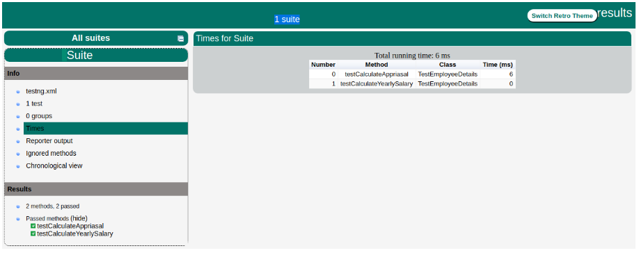

# TestNG (Testing framework for next generations )

## Uvod u TestNG

TestNG je open-source testing framework, koji je namijenjen **Java** programskom jeziku, a razvio ga je Cédric Beust. Omogućava pisanje specifičnih testova, koji provjeravaju ispravnost, efikasnost i očekivano ponašanje djelova aplikacije. Inspirisan je JUnit-om i prevazilazi njegove nedostatke, jer je dizajniran da olakša testiranje do kraja.

#### Neke prednosti TestNG-a u odnosu na JUnit

- Anotacije su lakše za razumijevanje
- Test slučajevi (cases) mogu lakše da se grupišu
- Moguće je paralelno testiranje
- Proizvodi HTML izvještaje za implementaciju
- Generiše logove
- Podržava tri dodatna nivoa, kao što su **@Before/After suite**, **@Before/AfterTest** i **Before/AfterGroup**
- Koristi više Java i OO funkcija

Koristeći TestNG, možemo da generišemo odgovarajući izvještaj i da lako saznamo koliko je test slučajeva prošlo, neuspješno ili preskočeno. Neuspjele test slučajeve možemo da izvršimo zasebno.

**Primjer:** Imamo 5 test slučajeva i jedna metoda je napisana za svaki od njih. (Pretpostavka da je program napisan koristeći glavnu metodu bez upotrebe TestNG.) Kada prvo pokrenemo program, uspješno se izvršavaju tri metode, a četvrta je neuspješna. Zatim, ispravimo greške prisutne u četvrtoj metodi i želimo da pokrenemo samo nju, jer se prve tri svakako izvršavaju uspješno. Sve ovo ne bi bilo moguće bez TestNG-a.

## Ključne karakteristike

- **Anotacije** (za laku identifikaciju metoda testa) - linije koda koje mogu da kontrolišu kako će se izvršiti metoda ispod njih. Uvijek im prethodi simbol **@**. Primjer:

```java
@Test(priority = 0)
public void goToHomepage() {
    driver.get(baseUrl);
    Assert.assertEquals(driver.getTitle(), "Welcome: Simon S");
}

@Test(priority = 1)
public void logout() {
    driver.findElement(By.linkText("SIGN-OFF")).click();
    Assert.assertEquals("Sign-on: Simon S", driver.getTitle());
}
```

Ovaj primjer jednostavno pokazuje, da metoda **goToHomepage()** treba da se izvrši prije **logout()** metode, jer ima niži prioritet.

- **Fleksibilne konfiguracije testova** - omogućava kreiranje fleksibilnih i dinamičkih konfiguracija testova, korišćenjem XML datoteka. To znači da lako možemo definisati kako, kada i koji testovi treba da se pokrenu, što je posebno korisno za složene test scenarije.
- **Podrška za paralelno izvršavanje testova** - značajno smanjuje vrijeme potrebno za izvršavanje velikog broja testova.
- **Snažna izvještavanja** - pruža detaljne izvještaje o izvršenju testova.
- **Zavisnosti** - podržava definisanje zavisnosti između test metoda.

## TestNG okruženje

- Sistemski zahtijevi : JDK 1.7 ili više

**Korak 1 - Instalacija Java programa**
- Instalirati Java programa, ako već nije instaliran. Link za instalaciju Java Software Development Kit (SDK): https://www.oracle.com/technetwork/java/javase/downloads/index.h

**Korak 2 - Podešavanje Java okruženja**
- Podesiti environment varijablu JAVA_HOME da ukazuje na lokaciju osnovnog direktorijuma, gdje je Java instalirana. Npr. za *Windows* podesiti varijablu JAVA_HOME na *C:\Program Files\Java\jdk15.0.2.* Zatim, dodati lokaciju Java kompajlera u sistemsku putanju. Dodati string *C:\Program Files\Java\jdk1.7.0_25\bin* na kraju System Variable, Path-a. Provjeriti instalaciju koristeći komandu *java -version*.

**Koark 3 - Preuzeti TestNG Archive**
- Preuzeti najnoviju verziju TestNG jar datoteke sa http://www.testng.org ili [odavde](https://mvnrepository.com/artifact/org.testng/testng).

**Korak 4 - Podešavanje TestNG okruženja**
- Podesiti environment varijablu TESTNG_HOME da ukazuje na lokaciju osnovnog direktorijuma, gdje je TestNG smješten na računaru. Npr. za *Windows*, pod pretpostavkom da je testng.jar smješten na lokaciji /work/testng, setujemo varijablu TESTNG_HOME na *C:\testng*.

**Korak 5 - Podešavanje CLASSPATH varijable**
- Za **Windows** postavljamo CLASSPATH environment varijablu da ukazuje na TestNG jar lokaciju, *%CLASSPATH%;%TESTNG_HOME%\testng-7.4.jar.*

**Korak 6 - Testiranje TestNG setup-a**
- Napraviti java klasu pod nazivom *TestNGSimpleTest* na /work/testng/src.

```java
import org.testng.annotations.Test;
import static org.testng.Assert.assertEquals;

public class TestNGSimpleTest {
   @Test
   public void testAdd() {
      String str = "TestNG is working fine";
      AssertEquals("TestNG is working fine", str);
   }
}
```
TestNG se može pozvati na nekoliko različitih načina :

- Sa testng.xml fajlom
- Sa ANT
- Sa komandne linije

U ovom primjeru se poziva putem datoteke testng.xml. Kreiramo xml datoteku testng.xml u /work.testng/src da bi se izvršili test slučajevi.

```html
<?xml version = "1.0" encoding = "UTF-8"?>
<!DOCTYPE suite SYSTEM "http://testng.org/testng-1.0.dtd" >

<suite name = "Suite1">
   <test name = "test1">
      <classes>
         <class name = "TestNGSimpleTest"/>
      </classes>
   </test>
</suite>
```

**Korak 7 - Verifikacija rezultata**
- Kompajliramo klasu koristeći javac compiler */work/testng/src$ javac TestNGSimpleTest.java*
- Pozivamo testng.xml da vidimo rezultat */work/testng/src$ java org.testng.TestNG testng.xml*
- Verifikacija output-a

```html
 ===============================================
  Suite
  Total tests run: 1, Passes: 1, Failures: 0, Skips: 0
  ===============================================

```
## Pisanje testova

- Prvo napisati biznis logiku vaših testova i ubaciti TestNG anotacije u kod
- Dodati informacije o testovima (npr. ime klase, grupe koje želimo da pokrenemo itd.) u testng.xml ili build.xml fajlu
- Kompletan primjer TestNG testiranja koristeći POJO (plain old Java object) klasu, Business logic klasu i test xml, koji će pokrenuti TestNG:

Kreirati **EmployeeDetails.java** u **/work/testng/src**, koja je POJO klasa.

```java
public class EmployeeDetails {

   private String name;
   private double monthlySalary;
   private int age;

   // @return the name

   public String getName() {
      return name;
   }

   // @param name the name to set

   public void setName(String name) {
      this.name = name;
   }

   // @return the monthlySalary

   public double getMonthlySalary() {
      return monthlySalary;
   }

   // @param monthlySalary the monthlySalary to set

   public void setMonthlySalary(double monthlySalary) {
      this.monthlySalary = monthlySalary;
   }

   // @return the age

   public int getAge() {
      return age;
   }

   // @param age the age to set

   public void setAge(int age) {
      this.age = age;
   }
}
```
**EmployeeDetails klasa** se koristi za:

- dobijanje/podešavanje vrijednosti imena zaposlenog
- dobijanje/podešavanje vrijednosti mjesečne zarade zaposlenog
- dobijanje/podešavanje vrijednosti godina zaposlenog

Kreirati **EmpBusinessLogic.java** u **/work/testng/src**, koja sadrži biznis logiku.

```java
public class EmpBusinessLogic {

   // Calculate the yearly salary of employee
   public double calculateYearlySalary(EmployeeDetails employeeDetails) {
      double yearlySalary = 0;
      yearlySalary = employeeDetails.getMonthlySalary() * 12;
      return yearlySalary;
   }

   // Calculate the appraisal amount of employee
   public double calculateAppraisal(EmployeeDetails employeeDetails) {

      double appraisal = 0;

      if(employeeDetails.getMonthlySalary() < 10000) {
         appraisal = 500;

      } else {
         appraisal = 1000;
      }

      return appraisal;
   }
}
```
**EmpBusinessLogic** klasa se koristi za izračunavanje:
 - godišnje zarade zaposlenog
 - iznosa povećanja plate zaposlenog

Sada, kreiramo TestNG klasu **TestEmployeeDetails.java** u  /work/testng/src. TestNG klasa je Java klasa koja sadrži barem jednu TestNG anotaciju. Ova klasa sadrži test slučajeve koji treba da budu testirani. TestNG test može biti konfigurisan pomoću @BeforeXXX i @AfterXXX anotacija, što omogućava izvršenje određene Java logike pre i posle određene tačke.

```java
import org.testng.Assert;
import org.testng.annotations.Test;

public class TestEmployeeDetails {
   EmpBusinessLogic empBusinessLogic = new EmpBusinessLogic();
   EmployeeDetails employee = new EmployeeDetails();

   @Test
   public void testCalculateAppriasal() {

      employee.setName("Rajeev");
      employee.setAge(25);
      employee.setMonthlySalary(8000);

      double appraisal = empBusinessLogic.calculateAppraisal(employee);
      Assert.assertEquals(500, appraisal, 0.0, "500");
   }

   // Test to check yearly salary
   @Test
   public void testCalculateYearlySalary() {

      employee.setName("Rajeev");
      employee.setAge(25);
      employee.setMonthlySalary(8000);

      double salary = empBusinessLogic.calculateYearlySalary(employee);
      Assert.assertEquals(96000, salary, 0.0, "8000");
   }
}
```
Klasa **TestEmployeeDetails** se koristi za testiranje metoda klase **EmpBusinessLogic**. Ona radi sledeće:

- Testira godišnju platu zaposlenog
- Testira iznos povećanja plate zaposlenog

Prije nego što možemo pokrenuti testove, moramo konfigurisati TestNG koristeći poseban XML fajl, koji se obično naziva testng.xml. Sintaksa za ovaj fajl je veoma jednostavna, a sadržaj je prikazan ispod. Kreirati ovaj fajl u **/work/testng/src** direktorijumu.

```html
<?xml version = "1.0" encoding = "UTF-8"?>
<!DOCTYPE suite SYSTEM "http://testng.org/testng-1.0.dtd" >

<suite name = "Suite1">
   <test name = "test1">
      <classes>
         <class name = "TestEmployeeDetails"/>
      </classes>
   </test>
</suite>
```
Detalji gore navedenog fajla su:

- Jedinica testiranja je predstavljena jednim XML fajlom. Može sadržati jedan ili više testova i definiše se pomoću taga <suite>.
- Tag <test> predstavlja jedan test i može da sadrži jednu ili više TestNG klasa.
- Tag <class> predstavlja TestNG klasu. To je Java klasa koja sadrži barem jednu TestNG anotaciju. Može da sadrži jednu ili više metoda za testiranje.

Da bi kompajlirali klase za testiranje koristeći **'javac'**, koristimo komandu:

```java
/work/testng/src$ javac EmployeeDetails.java EmpBusinessLogic.java TestEmployeeDetails.java
```

Sada, pokrenemo TestNG pomoću sledeće komande, navodeći putanju do našeg **'testng.xml'** fajla:

```java
java org.testng.TestNG testng.xml
```
Ako je sve urađeno ispravno, trebalo bi vidjeti rezultate testova u konzoli. Dodatno, TestNG kreira veoma lijep HTML izvještaj u folderu koji se zove test-output, koji se automatski kreira u trenutnom direktorijumu. Ako ga otvorimo i učitatamo index.html, vidjećemo stranicu sličnu onoj na slici ispod:

